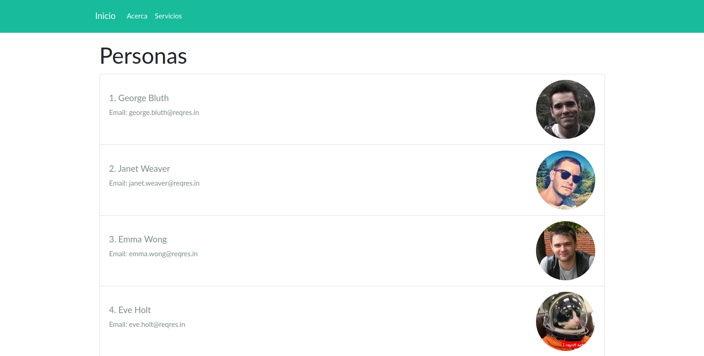
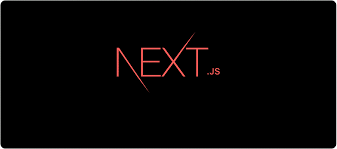
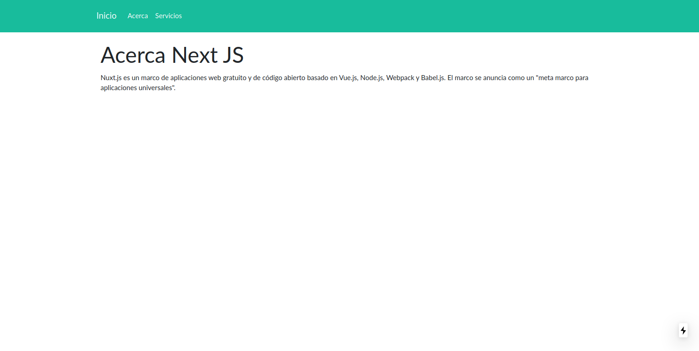
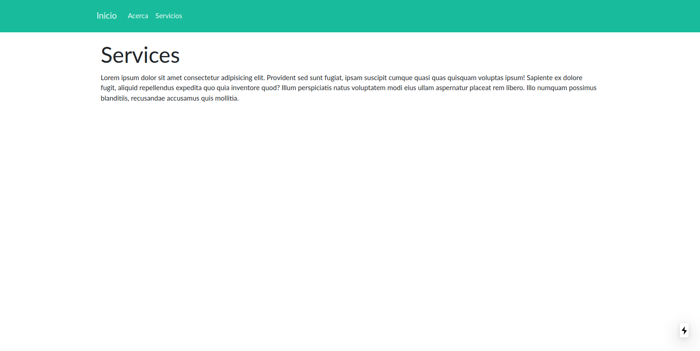
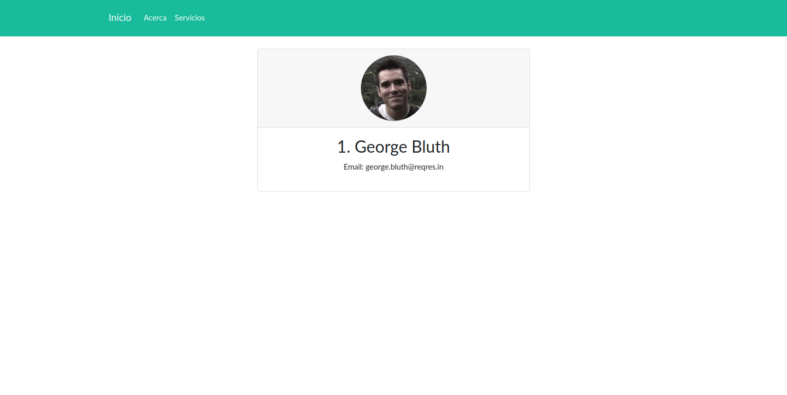

# Aplicacion de catalogo con Next JS
## Juan Pablo de Jesus Figueroa Jaramillo

## Que es Next JS?

NextJS, según su definición, es un pequeño framework que hace server-rendering de aplicaciones basadas en JavaScript. Como desarrolladores entre nuestros propósitos encontramos el hecho de hacer las cosas de una manera más facil y eso no es más que lo que nos trae Next, abstrayendo toda la parte del Server Rendering que a veces nos puede causar dolores de cabeza. 

## De que trata el proyecto?

Es una pequeña aplicacion utilizando los datos de una API publica para mostrar el catalogo de unas personas con su informacion de contacto, la aplicacion cuenta con varias rutas, tales son:

1. Inicio: Pagina de inicio donde se desplega el catalogo.

2. Acerca: Una introduccion acerca de la página.

3. Servicios.

4. User: aqui se desplega la informacion en general de la persona que se escoje

## Como iniciar

1. Clona este repositorio 
2. Descarga los paquetes necesarios con npm con el siguiente comando:

            npm install

3. Una vez instalados los paquetes ya puedes lanzar el modo desarrollador con el comando:

            npm run dev